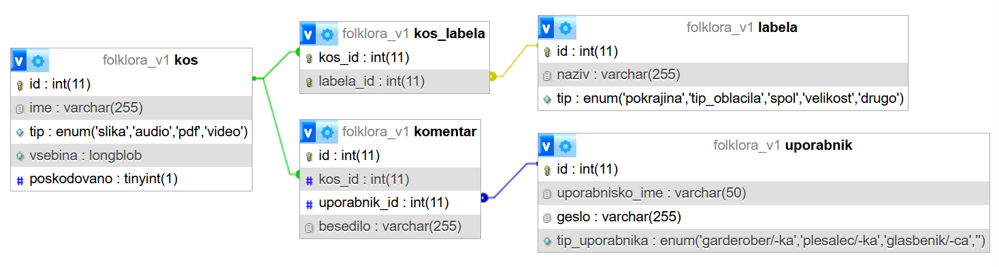

### Namen aplikacije
Aplikacija je namenjena vzdrževanju evidence kosov oblačil folklorne skupine, označevanju kosov s poljubnimi labelami, označevanje poškodovanih kosov in komentiranje. 

### Arhitektura sistema
- zaledni del (REST API) -> Node.js + Express
- odjemalci
    1. spletna aplikacija (frontend) -> Node.js + Express 
    2. mobilna aplikacija -> Android (Java)
- podatkovna baza -> MySQL (XAMPP)

Avtentikacija uporabnikov je izvedena z JWT (JSON Web Token), ki se po uspešni prijavi pošilja v HTTP Authorization headerju.

### Podatkovni model
Na sliki je prikazana struktura podatkovne baze in relacije med tabelami.

### API dokumentacija

Dokumentacija REST API-ja je v lokalni postavitvi dostopna preko Swagger UI:
http://localhost:3000/api-docs

---

### Navodila za zagon projekta

#### 0. Zahtevana programska oprema
- Node.js + npm 
- XAMPP (MySQL)
- Android Studio + Android SDK
- Git

---

#### 1. Kloniramo 3 ločene repozitorije, vsakega v svojo mapo:

- https://github.com/anajenko/folklora_backend  
- https://github.com/anajenko/folklora_frontend  
- https://github.com/anajenko/folklora_mobile  

---

#### 2. Pripravimo bazo

1. v XAMPP Control Panel vklopimo `Apache` in `MySQL` 

2. v brskalniku odpremo http://localhost/phpmyadmin 

3. ustvarimo novo bazo podatkov

4. uvozimo datoteko: `folklora_v1.sql`

---

#### 3. Zagon backend-a

1. premaknemo se v backend mapo

2. poženemo ukaz `npm install`

3. ustvarimo `.env` datoteko v root mapi z vsebino: "JWT_SECRET=poljubna_vrednost", kjer poljubno spremenimo vrednost jwt skrivnosti

4. v datoteki `utils/db.js` nastavimo MySQL credentials. XAMPP nastavi privzeto:
    - user: `root`
    - password: *(prazno)*

5. zagon backend-a -> `npm run dev` (teče na http://localhost:3000)

---

#### 4. Zagon frontend-a

1. premaknemo se v frontend mapo

2. poženemo ukaz `npm install`

3. zagon frontend-a -> `npm run dev` (teče na http://localhost:3001)

---

#### 5. Zagon Android aplikacije

1. odpremo projekt v Android Studiu
   - po potrebi izvedemo: `Gradle Sync` in `Clean & Rebuild`

2. v `RetrofitClient.java` nastavimo: BASE_URL = http://IP_NASLOV_RACUNALNIKA_S_POGNANIM_BACKEND:3000/
    - Telefon mora biti v istem omrežju kot računalnik (isti WiFi ali hotspot)

---

#### 6. Registracija in prijava

1. uporabnik se registrira preko spletne aplikacije: http://localhost:3001/registracija

2. po registraciji se lahko prijavi:
    - v spletni aplikaciji
    - ali v mobilni aplikaciji

opomba: pravico za dodajanje in brisanje kosov imajo samo garderoberji
